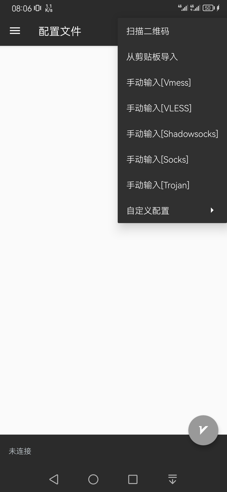
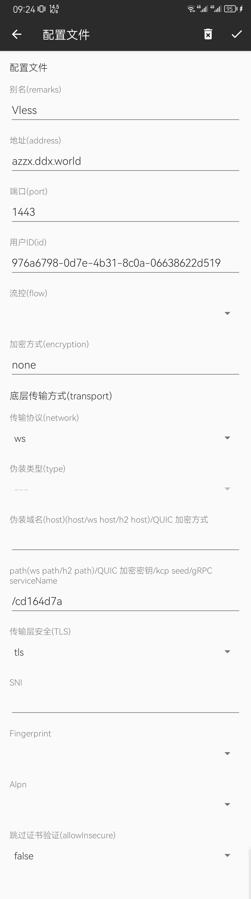
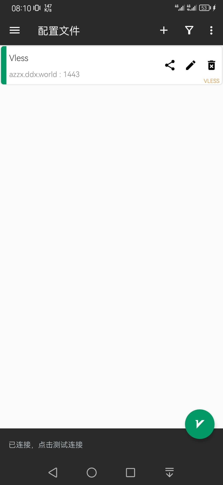
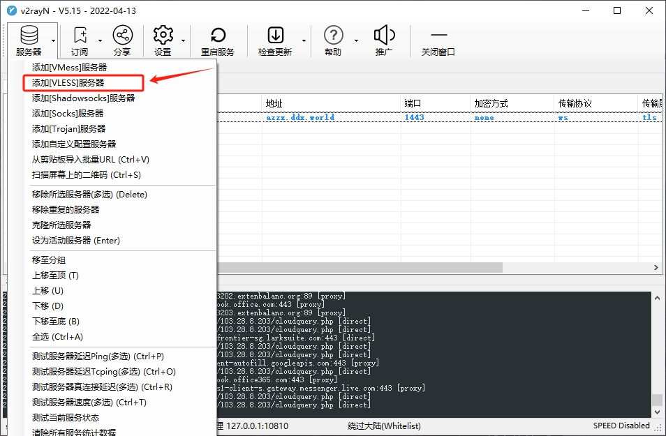
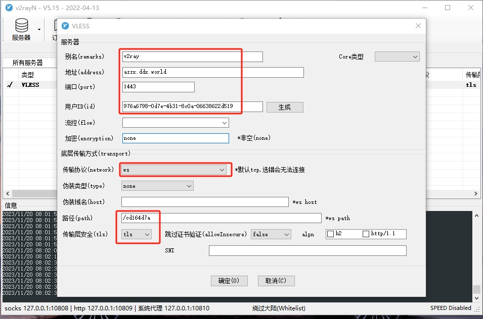
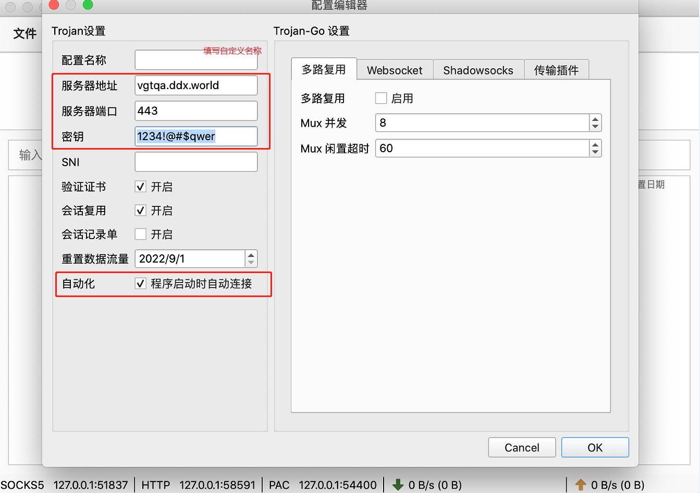
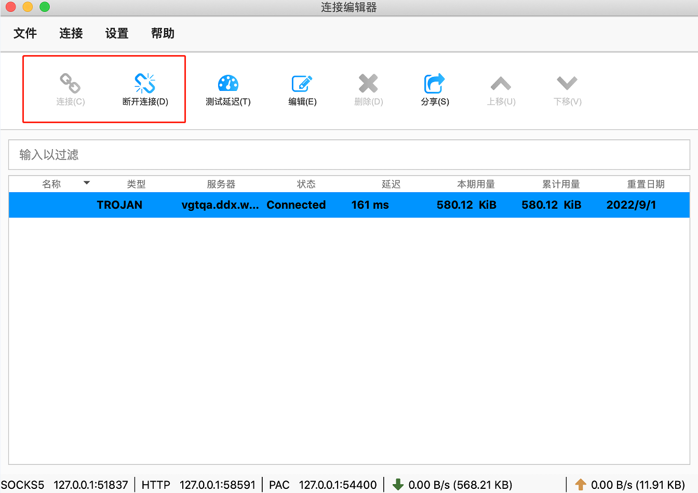

# 自用免费节点,可以访问一些国外常用网站(节点不定期更新)
服务器类型: vless, 
别名:自己起个任意名称, 
地址: azzx.ddx.world, 
端口: 1443, 
用户id: 976a6798-0d7e-4b31-8c0a-06638622d519, 
传输协议: websocket (一般客户端中的选项为: ws), 
websocket路径:/cd164d7a, 
底层传输协议: tls 

## Android、Windows、mac系统的安装步骤。

[查看安卓配置教程](#一android手机客户端配置步骤)
 
[安卓apk下载链接 V2rayNG](https://github.com/davpeterabc/personal_softwares/raw/main/v2rayNG-v1.8.5.apk)
 
 
[查看Windows配置教程](#二windows客户端配置步骤)
 
[Windows客户端下载链接](https://github.com/davpeterabc/personal_softwares/raw/main/v2rayN-v4.32.zip)
 
 
[查看Mac配置教程](#三mac客户端配置步骤)
 
[Mac客户端下载链接](https://github.com/davpeterabc/personal_softwares/raw/main/Trojan-Qt5-v1.4.0.dmg)
 
 
[查看IOS配置教程](#四IOS客户端安装)
 

# 一、Android手机客户端配置步骤

## 1.APP安装文件
拷贝到手机并安装，完成后点击图标运行(应用名称:v2rayNG) 

## 2.参数配置
点击“+”，选择“手动输入[VLESS]” 
 

V2rayNG 配置界面 
 

## 3.运行APP
点击选中列表中的服务器，再右下角“V”形图标，启动VPN服务； 
 

# 二、Windows客户端配置步骤

## 1.解压文件
解压客户端程序到指定的安装路径，如：D:\Program Files 
 

## 2.配置客户端程序

双击运行客户端 
 

此时客户端软件已在任务栏通知区域（电脑右下角）显示 
 

鼠标右键点击上述图标，设置代理模式： 
 

点击图标，打开软件界面-添加服务器 
 

填写服务器参数 
 

点击确定即完成配置。

# 三、Mac客户端配置步骤

## 1.安装文件
安装包拷贝到电脑并安装运行。 
 
 

## 2.参数配置
添加服务并配置参数，选择“Trojan” 
 
 
截图中的服务器为示例，当前可用服务器信息请查看readme文件。 

## 3.运行APP
 

# 四、IOS客户端安装
## 1.苹果安装VPN客户端，需要大陆境外Apple ID。请根据以下步骤获取。
[注册境外Apple ID](https://oneclick.earth/help/appleid.html)

## 2.iOS请安装小火箭
https://shadowsockshelp.github.io/ios/

