# 自用免费节点,可以访问一些国外常用网站(节点不定期更新)
服务器类型: Trojan 
地址: sg1-ip-2.ddx.world 
端口: 443 
用户id: VwIr2fHutH 
传输协议: ws 
websocket路径: /nogamenolife 
底层传输协议: tls 

## Android、Windows、mac系统的安装步骤。

[查看安卓配置教程](#一android手机客户端配置步骤)
 
[安卓apk下载链接](https://raw.githubusercontent.com/davpeterabc/personal_softwares/main/Client/clash-for-android-2.4.9.apk)
 
 
[查看Windows配置教程](#二windows客户端配置步骤)
 
[Windows客户端下载链接](https://raw.githubusercontent.com/davpeterabc/personal_softwares/main/Client/Clash.for.Windows.Setup.0.19.20.exe)
 
 
[查看Mac配置教程](#三mac客户端配置步骤)
 
[Mac客户端下载链接](https://raw.githubusercontent.com/davpeterabc/personal_softwares/main/Client/ClashX.Meta.macOS.12.0+.zip)
 
 
[查看IOS配置教程](#四IOS客户端安装)
 

# 一、Android手机客户端配置

## 1.配置界面
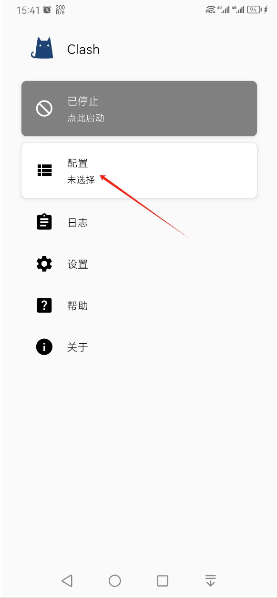 
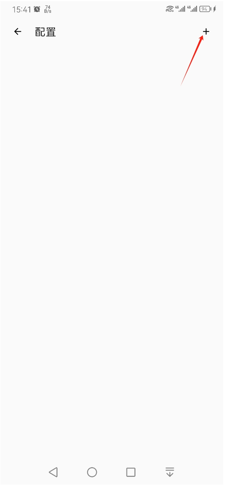 
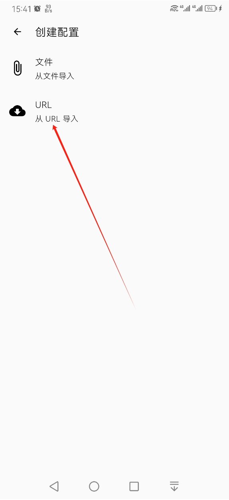 
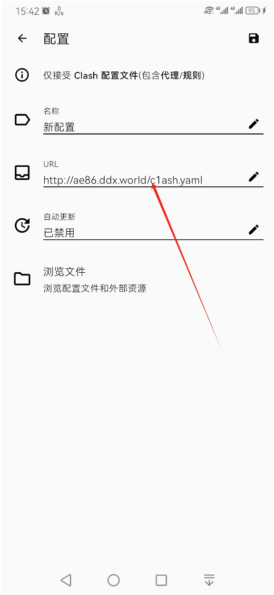 
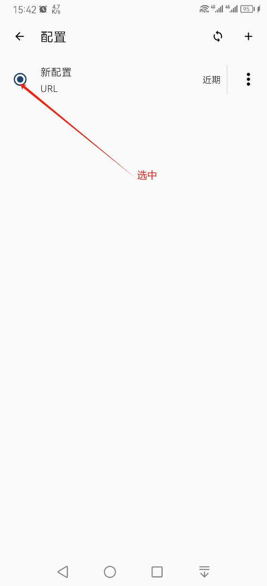 
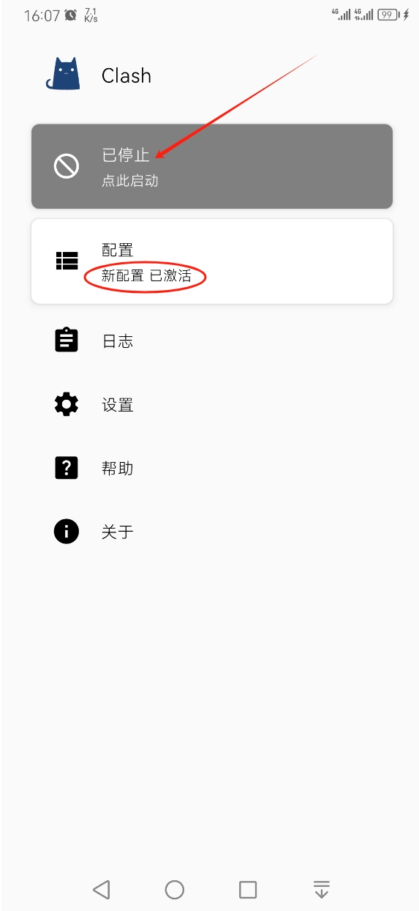 
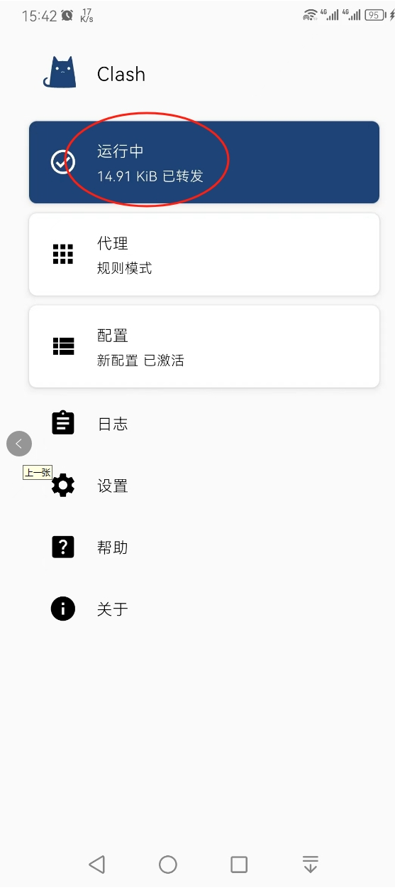 

# 二、Windows客户端配置步骤

## 1.解压文件
解压客户端程序到指定的安装路径，如：D:\Program Files 
 

## 2.配置客户端程序

双击运行客户端 
 

此时客户端软件已在任务栏通知区域（电脑右下角）显示 
 

鼠标右键点击上述图标，设置代理模式： 
 

点击图标，打开软件界面-添加服务器 
 

填写服务器参数 
 

点击确定即完成配置。

# 三、Mac客户端配置步骤

1.安装V2rayU.dmg应用到mac 
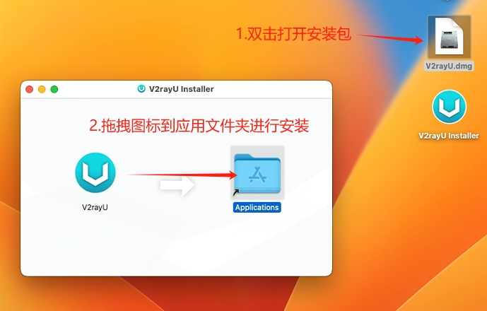 
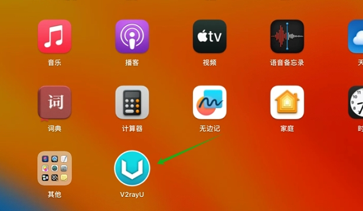 

2.配置服务器： 
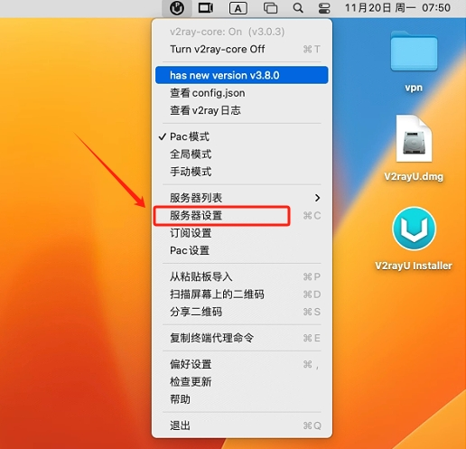 
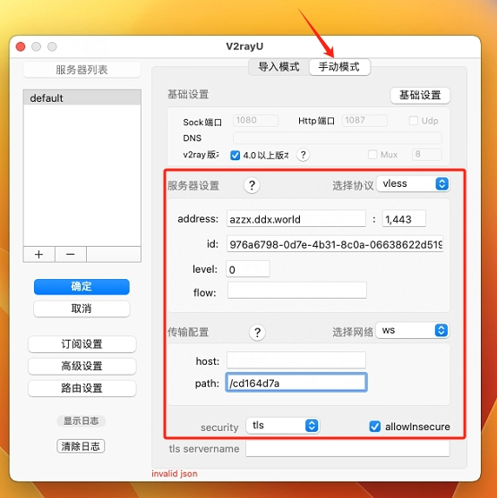 

3.启动服务： 
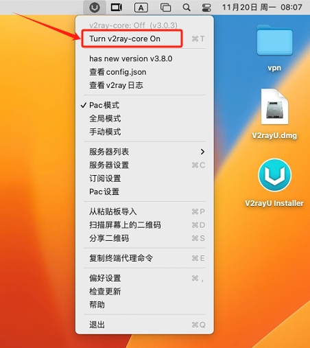 

# 四、IOS客户端安装
## 1.苹果安装VPN客户端，需要大陆境外Apple ID。请根据以下步骤获取。
[注册境外Apple ID](https://oneclick.earth/help/appleid.html)

## 2.iOS请安装小火箭
https://shadowsockshelp.github.io/ios/

