# 自用免费trojan节点,可以访问一些国外常用网站(节点不定期更新)
服务类型选择：trojan 
服务器：otzyr.ddx.world  
服务器动态更新中，如果发现无法使用请查看本文件中最新的服务器 
端口：443 
密码：1234!@#$qwer 

## Android、Windows、mac系统的安装步骤。

[查看安卓配置教程](#一android手机客户端配置步骤)
 
...[安卓apk下载链接 SagerNet](https://github.com/davpeterabc/personal_softwares/raw/main/SN-0.8.1-beta02-arm64-v8a.apk) ...
[安卓apk下载链接 V2rayNG](https://github.com/davpeterabc/personal_softwares/raw/main/v2rayNG-v1.8.5.apk)
 
 
[查看Windows配置教程](#二windows客户端配置步骤)
 
[Windows客户端下载链接](https://github.com/davpeterabc/personal_softwares/raw/main/v2rayN-v4.32.zip)
 
 
[查看Mac配置教程](#三mac客户端配置步骤)
 
[Mac客户端下载链接](https://github.com/davpeterabc/personal_softwares/raw/main/Trojan-Qt5-v1.4.0.dmg)

# 一、Android手机客户端配置步骤

## 1.APP安装文件
拷贝到手机并安装，完成后点击图标运行 

(1) SagerNet 

V2rayNG 

## 2.参数配置
点击“+”，选择手动输入-[Trojan] (V2rayNG配置类似) 

SagerNet 配置界面 
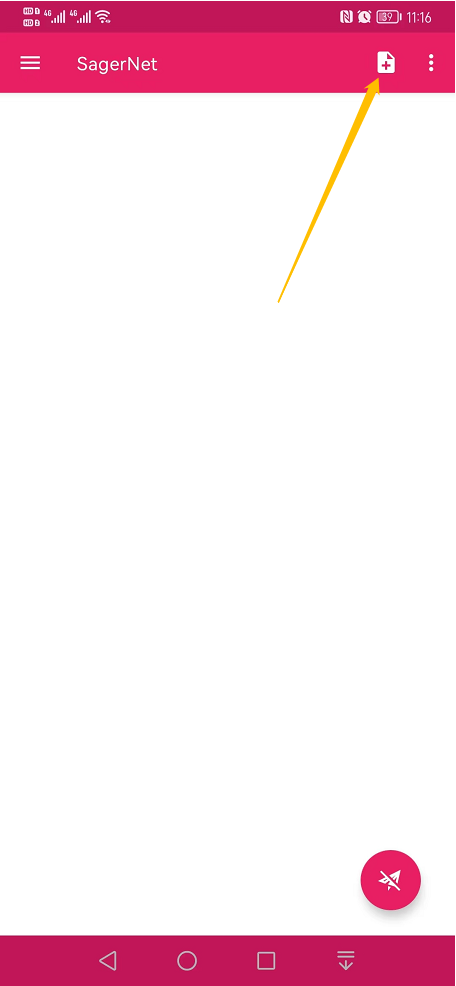 
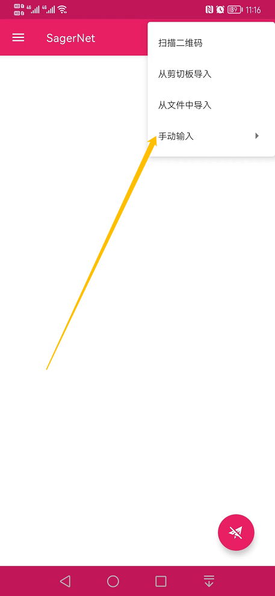 
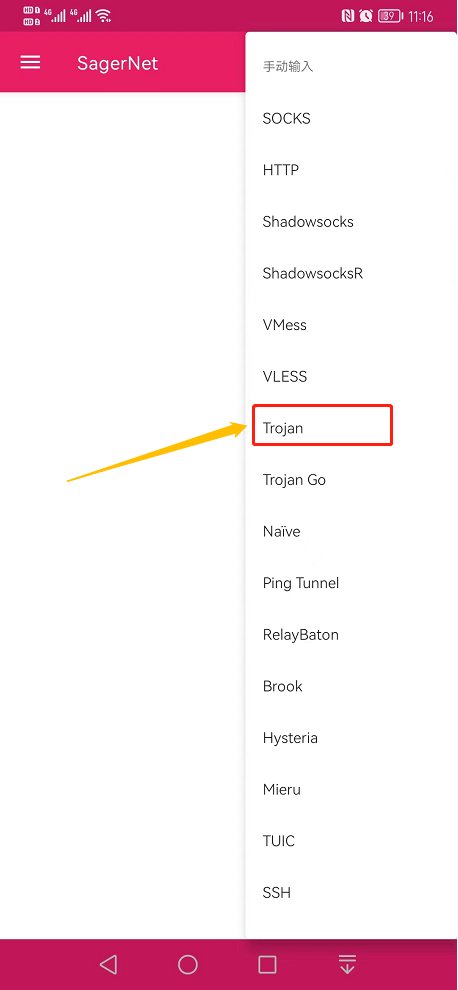 
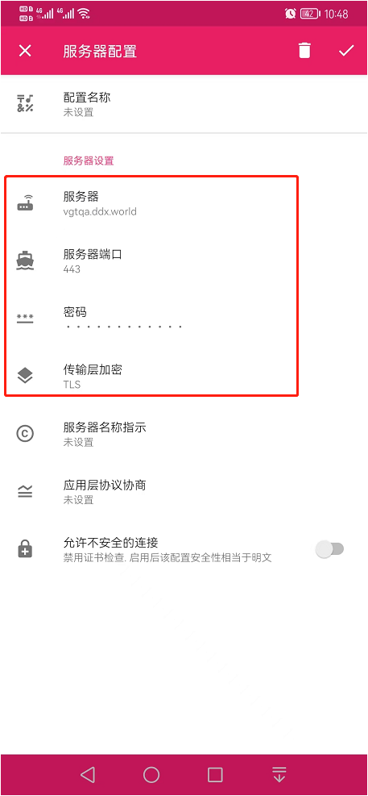 

(2) V2rayNG 配置界面 
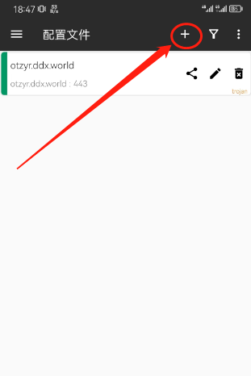 
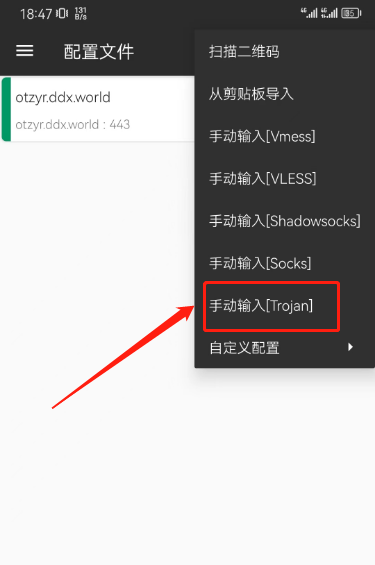 
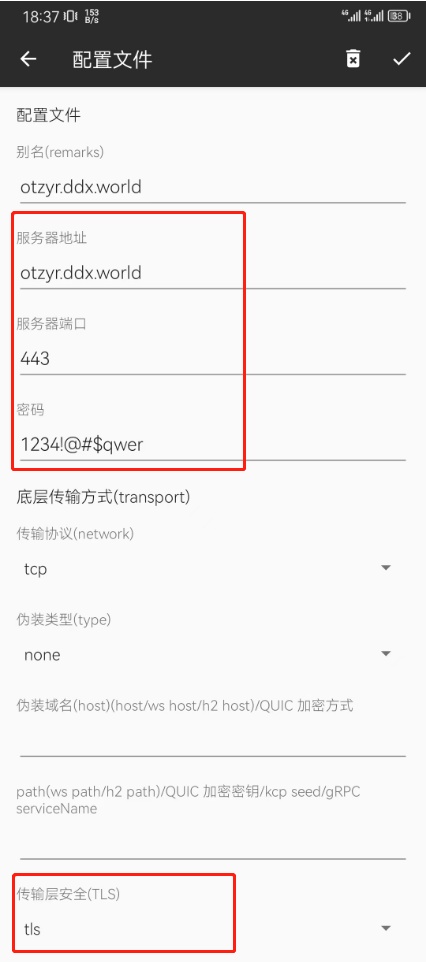 

## 3.运行APP
点击选中列表中的服务器，再右下角“V”形图标，启动VPN服务； 
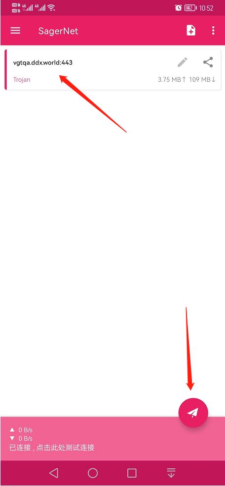 

# 二、Windows客户端配置步骤

## 1.解压文件
解压客户端程序到指定的安装路径，如：D:\Program Files 
 

## 2.配置客户端程序

双击运行客户端 
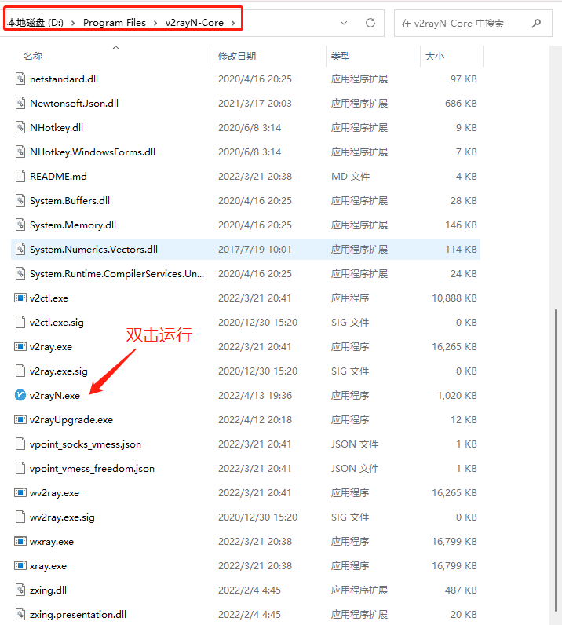 

此时客户端软件已在任务栏通知区域（电脑右下角）显示 
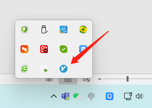 

鼠标右键点击上述图标，设置代理模式： 
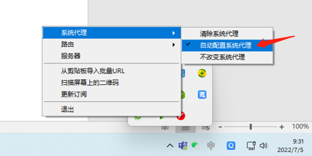 

点击图标，打开软件界面-添加服务器 
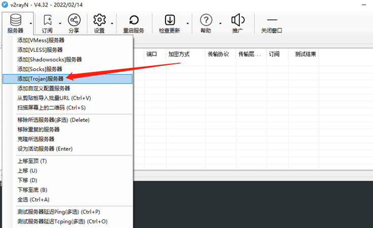 

填写服务器参数 
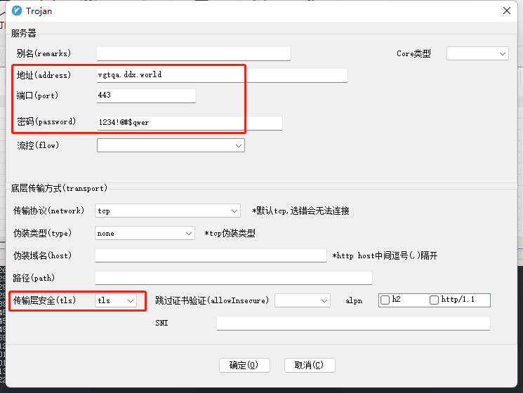 

点击确定即完成配置。

# 三、Mac客户端配置步骤

## 1.安装文件
安装包拷贝到电脑并安装运行。 
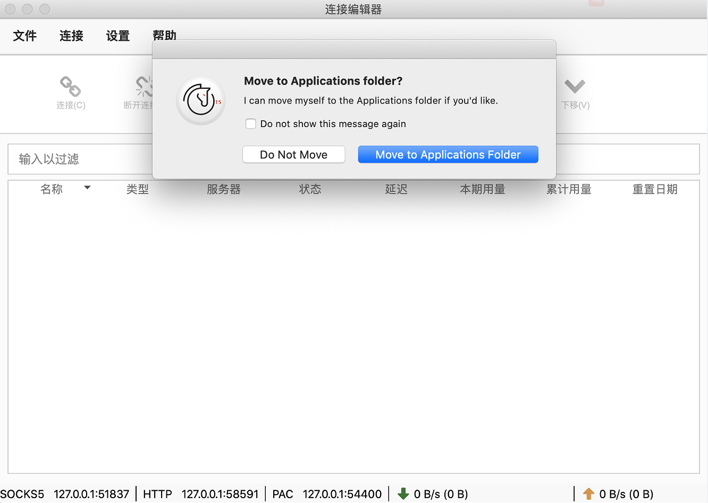 
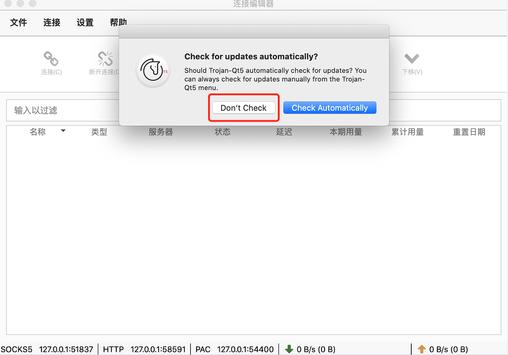 

## 2.参数配置
添加服务并配置参数，选择“Trojan” 
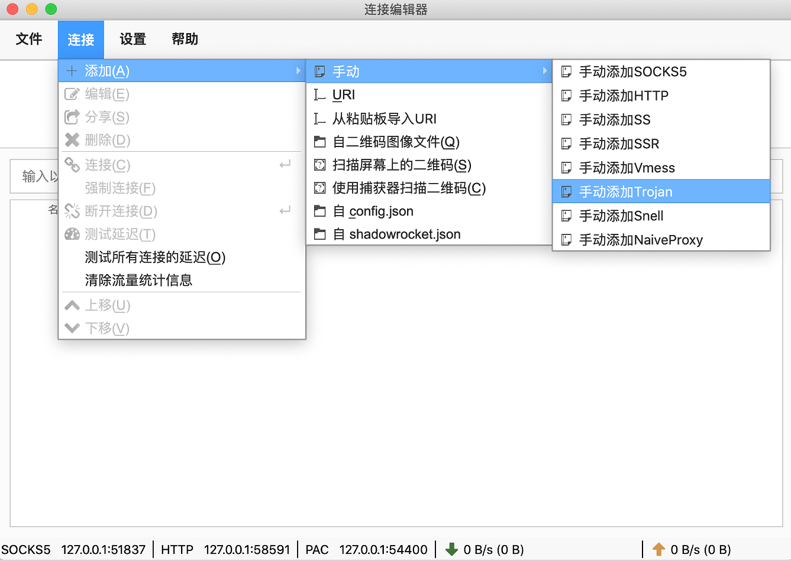 
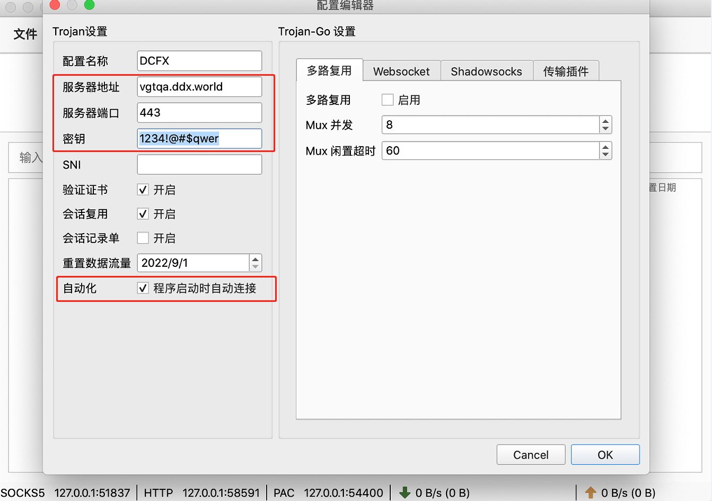 
截图中的服务器为示例，当前可用服务器信息请查看readme文件。 

## 3.运行APP
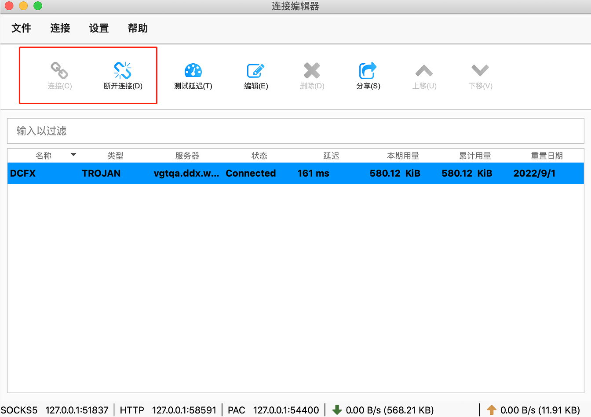 
