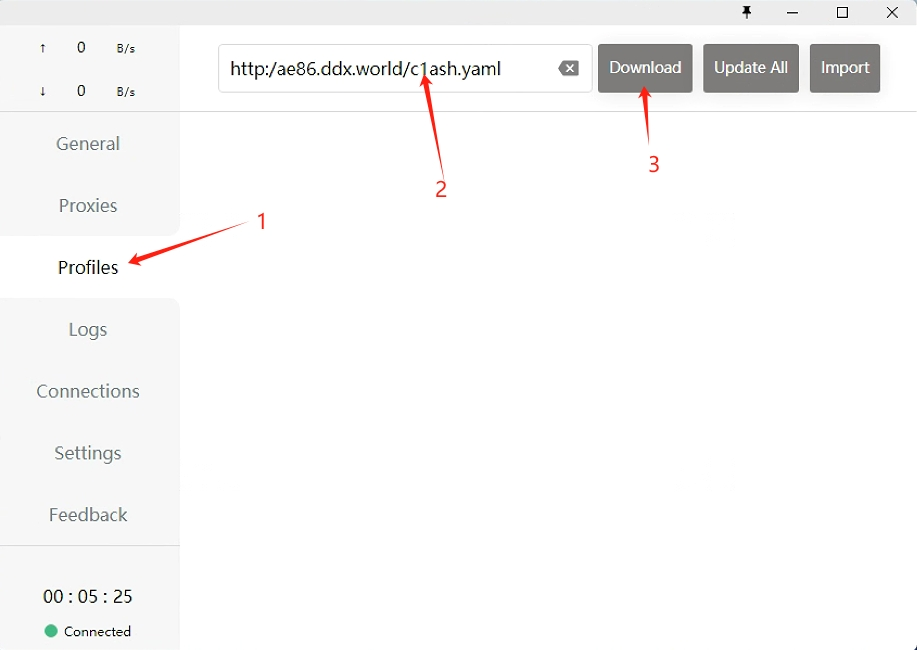

# 自用免费节点,可以访问一些国外常用网站(节点不定期更新)

## 手动配置参数
服务器类型: Trojan 
地址: sg1-ip-2.ddx.world 
端口: 30500 
用户id: VwIr2fHutH 
传输协议: ws 
websocket路径: /nogamenolife 
底层传输协议: tls 

## 订阅源 
http://ae86.ddx.world/c1ash.yaml --推荐使用，以下说明均以订阅源为示例的配置步骤 
或 
下载c1ash.yaml文件import到客户端 
 
 
## Android、Windows、mac系统的安装步骤。

[查看安卓配置教程](#一android手机客户端配置步骤)
 
[安卓apk下载链接](https://github.com/davpeterabc/personal_softwares/raw/main/Client/clash-for-android-2.4.9.apk)
 
 
[查看Windows配置教程](#二windows客户端配置步骤)
 
[Windows客户端下载链接](https://github.com/davpeterabc/personal_softwares/raw/main/Client/Clash.for.Windows.Setup.0.19.20.exe)
 
 
[查看Mac配置教程](#三mac客户端配置步骤)
 
[Mac客户端下载链接](https://github.com/davpeterabc/personal_softwares/raw/main/Client/Trojan-Qt5-v1.4.0.dmg)
 
 
[查看IOS配置教程](#四IOS客户端安装)
 

# 一、Android手机客户端配置

## 1.配置界面
 
 
 
 
 
 
 

# 二、Windows客户端配置步骤

## 1.配置界面 
 
 
 
 
系统任务栏找到软件图标，右键重启软件 
 
 

# 三、Mac客户端配置步骤

## 1.配置界面 
 
 
 
 
 

# 四、IOS客户端安装
## 1.苹果安装VPN客户端，需要大陆境外Apple ID。请根据以下步骤获取。
[注册境外Apple ID](https://oneclick.earth/help/appleid.html)

## 2.iOS请安装小火箭
https://shadowsockshelp.github.io/ios/

